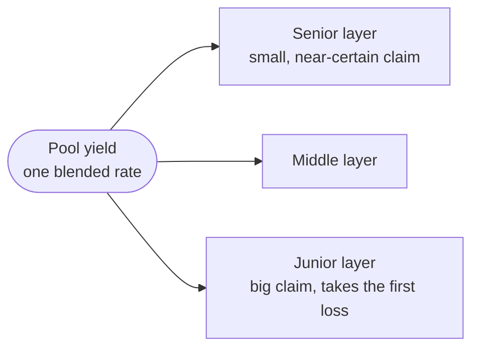
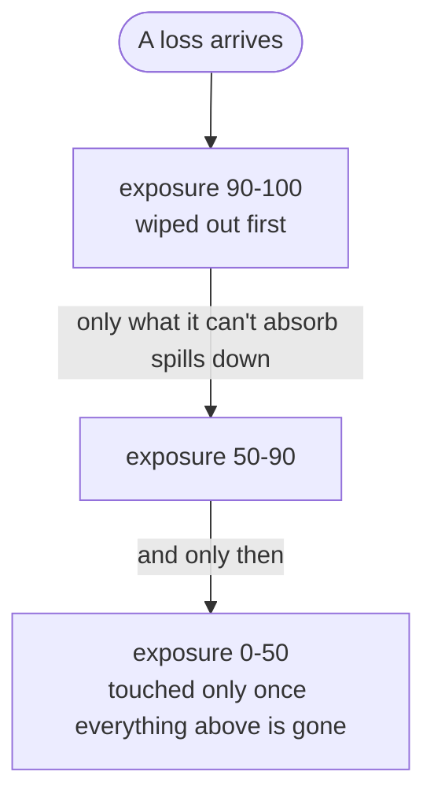

# Context

What this project is, the vocabulary it borrows, and where the code
currently stands. Read this first; [Mental Model #1](./mental-model-1.md)
builds on it.

## The problem

A pool of capital earns yield from some underlying asset. Everyone who
deposits into it earns the same blended rate — but depositors don't
have the same appetite. Some want a low, near-certain return; others
will take first losses in exchange for a bigger claim on the upside.
One blended rate serves neither well.

**Tranching** splits that single pool return into layers with different
risk. Losses eat the top layers first; yield is paid out favouring
them, so the layer that absorbs the first hit is compensated for it.
The bottom layer is quiet and cheap, the top layer is loud and
expensive, and depositors self-select.

This repo is a prototype for doing that on-chain: how a position is
split, how the layers get priced, and how they change hands.

The mechanism is **asset-agnostic**. It cares about the shape of the
yield the pool produces, not what generates it — where that yield comes
from is out of scope here.

## The exposure axis

Everything is organised on one axis: **exposure**, running 0 to 100.

Think of it as position in the loss waterfall. Exposure 0 is the very
safest capital — everything above it has to be wiped out before it's
touched. Exposure 100 is the very first capital to take a loss. A
**tranche** is a band on this axis, `[attachment, detachment)`, and it
owns the risk and the yield of that slice.

Yield runs the other way: the band that stands in front of the loss is
the one paid the most for it.

Two consequences worth internalising:

- Bands are **relative, not absolute**. The boundary at 50% always has
  half of total liquidity below it protecting it, however much
  liquidity there is in total. Nothing is denominated in a fixed dollar
  cap.
- Bands **tile the axis** — no gaps, no overlaps. Every unit of
  exposure belongs to exactly one band.

Both are visible in the same picture — the boundaries don't move
between these two pools, only the dollars sitting behind them:

```mermaid
gantt
    title The same bands over two different pool sizes
    dateFormat X
    axisFormat %s

    section Pool = $10M
    $5.0M   :done, 0, 50
    $2.5M   :active, 50, 75
    $2.5M   :crit, 75, 100

    section Pool = $40M
    $20M    :done, 0, 50
    $10M    :active, 50, 75
    $10M    :crit, 75, 100
```

## Vocabulary

The terms come from reinsurance and structured credit. They're used
here in their standard senses.

| Term | Meaning here |
|---|---|
| **Exposure** | Position on the 0–100 risk axis; 0 = safest, 100 = first loss. |
| **Tranche / band** | A contiguous slice of the exposure axis, sold as a unit. |
| **Attachment** | The band's lower edge — losses reach it only after everything above is gone. |
| **Detachment** | The band's upper edge — beyond it, the loss is someone else's problem. |
| **Senior** | Low-exposure: first to stay whole, last and smallest claim on yield. |
| **Junior** | High-exposure: first to absorb losses, first and biggest claim on yield. |
| **Rate** | The yield a band is priced at. |
| **Quote** | One market data point: an expected yield, a target exposure, a size. |
| **Position** | A depositor's stake, plus the exposure range they currently hold. |
