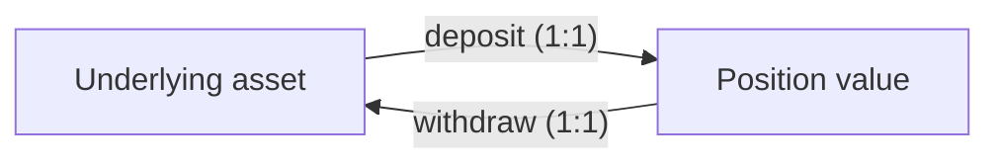
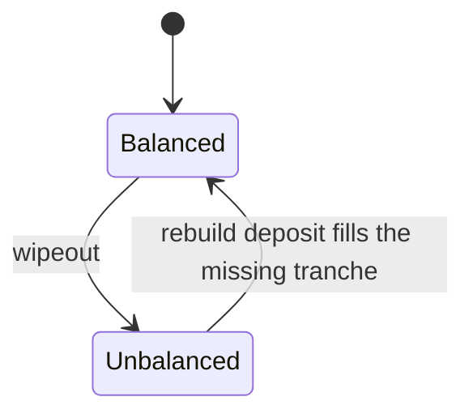

# Invariants

Properties that should hold regardless of implementation details — truths the
system is built around, independent of how positions, tranches, or the
underlying yield source end up being coded. This list starts with three and
will grow.

## Position value is never negative

A position's value can trend toward zero — in the worst case, full default of
the underlying asset — but it never goes negative. Even heading into default,
the position was still earning yield right up to that point, so its value only
ever approaches zero asymptotically; there's no state where a position owes
more than it's worth.

## Position value is conserved against the underlying asset

Depositing locks in a position sized to the value of the deposit: the position
is a claim on that much underlying asset. Withdrawing later returns that value
back in the underlying asset — the whole of it, ideally, or at least whatever
part of it remains. Position value and underlying-asset value are pegged 1:1
by this deposit/withdraw pact in both directions; nothing is created or
destroyed crossing that boundary.

## Tranche liquidity stays balanced

Liquidity across tranches is always balanced. The pool has two modes for
maintaining that, and a rebuild deposit is the only way from one back to
the other:

### Normal operation

This holds by construction: the system only accepts deposits that keep the
tranches balanced, so a deposit can never itself introduce an imbalance.
`src/tranche.rs` already carries a version of this guarantee for its static
snapshot — `compute_tranches`' bands are cut so "fractions sum to 1.0 and
liquidity is monotonic," landing every band on essentially exactly its
target share — though deposit/withdraw logic itself doesn't exist yet.

### Wipeout

A **wipeout event** is a default that clears out one or more tranches
entirely — say, all junior tranches wiped while senior tranches remain —
and leaves the pool unbalanced. It isn't a phase of its own; it's the event
that flips the pool straight from balanced into the unbalanced mode above.

The pool doesn't stay stuck there; it works back toward balance. Senior
tranches aren't punished for the wipeout: everything they'd already earned
before the default stays theirs, nothing is clawed back. But going forward,
until the pool rebalances, they simply stop earning any *further* yield —
which nudges senior holders to either shift capital into the missing junior
tranches or step out temporarily, either of which helps rebalance. That
forgone yield is redirected in full to deposits that rebuild the missing
tranches, in proportion to what's missing: every such deposit is rewarded
with the yield senior isn't earning, and every such deposit moves the pool
strictly closer to balanced, never further from it.
