# Mental Model #1

How a position gets split into tranches and how those tranches change
hands. Builds on [Context](./context.md) — the exposure axis, bands,
attachment/detachment and senior/junior are as defined there. Where the
underlying yield actually comes from is treated as a black box here —
out of scope for this page.

## Positions

A user enters by depositing into the pool — the **primary market**. A
position is, concretely: `(owner, size, exposure range currently
held)`. On entry that range is always the whole axis, `[0, 100]`, sized
by the deposit — not a slice of it, and there's no pricing question
here: the deposit *is* the position, 1:1 in the underlying asset. While
unsplit, a position earns the pool's blended yield across that whole
range. Selling only ever narrows the range — selling is the
**secondary market**, covered below; it never moves the position
sideways.

## Tranche bands

The axis is cut into a **fixed, predefined** set of bands, mortgage-style:
a fat one at the bottom, then progressively thinner ones toward the top.

The bounds aren't chosen per-trade — a seller exits along one of these
preset boundaries (e.g. "sell my senior 50%"), never an arbitrary custom
slice: a 50% senior tranche, then 25%, 15%, 5%, 5% bands rising in risk.

The bar below is the actual axis, to scale, with the real boundaries
marked — hover a band for its exact range.

  

    

    

    

    

    

  

  

    0
    50
    75
    90
    95
    100
  

  

    

      
Senior

      
fat, safe, first to stay whole

    

    

      
Junior

      
thin, risky, first to absorb losses

    

  

## Selling a band

Worked example: a user enters on the full `[0, 100]` range, earning
blended yield. They decide to sell their senior tranche — the bottom
50%.

Selling a band transfers it **outright, going forward**: the buyer now
owns that exposure band from that point on — bearing its risk and
receiving its yield. The seller's position shrinks to whatever they
didn't sell — here, the junior `[50, 100]` remainder. Nothing about the
past is undone; this only changes who holds the band from the sale
onward.

## Secondary market: order book

Each fixed tranche band has its **own, separate order book** — a senior
50% order isn't fungible with a junior 5% order, so their markets don't
mix. An order is a **principal and a price**: how much of the band, and
what you're willing to pay for it, priced in the same token as the
primary market (the underlying asset) — not as a yield rate. Buyers and
sellers cross orders directly; there's no epoch, no batching, no waiting
for a close. A crossable order fills immediately.

Because both the primary and secondary markets are **reversible**
(deposit ↔ withdraw, buy ↔ sell) and both are always available
atomically, the two are always tradeable against each other. That
keeps the secondary market **pegged to the primary**: if a band's
order-book price drifted from what the primary market implies for that
slice, an arbitrageur could deposit (or withdraw) on the primary side
and trade the difference away on the secondary side for a profit. The
peg is enforced by arbitrage, not by protocol fiat.

The diagram below traces that arbitrage loop for a single band.

Order books this way are inherently **discrete** — one per fixed band,
about five of them today. A future version could
generalize this into a single **continuous market**, two-dimensional
over risk and yield, tracing out a full risk/reward curve instead of
five discrete points on it. That's a later step; for now, discrete
bands with discrete order books is the design.

## Worked example

The same position, at three points in time: full range at entry, after
selling the senior tranche outright, and with part of the remainder
resting as an open order on that band's order book (committed, not yet
filled).

```mermaid
gantt
    title Target exposure (%), 0-100
    dateFormat X
    axisFormat %s

    section At entry
    held           :done, 0, 100

    section After selling the senior tranche
    sold           :crit, 0, 50
    held           :done, 50, 100

    section Listing part of the remainder
    sold           :crit, 0, 50
    listed         :active, 50, 75
    held           :done, 75, 100
```

- **held** (gray) — still part of your position, earning its share of
  yield.
- **sold** (red) — transferred outright; the buyer now owns this band
  going forward.
- **listed** (blue) — a resting order on that band's order book,
  committed but unfilled.

## Open questions

Deliberately unresolved for now — flagged so they don't get silently
assumed:

- Do resting orders expire, or stay open indefinitely until filled or
  cancelled?
- Who performs the primary/secondary arbitrage that keeps the peg —
  is it permissionless (anyone, MEV-style), or a protocol-level actor?
- What backs market-making on a thin or newly-opened band's order book
  well enough to keep its price reasonable?
- Can a position be sold down across multiple separate fills (partial
  sales layered over time), or is a band's exit an all-or-nothing event
  per position?
