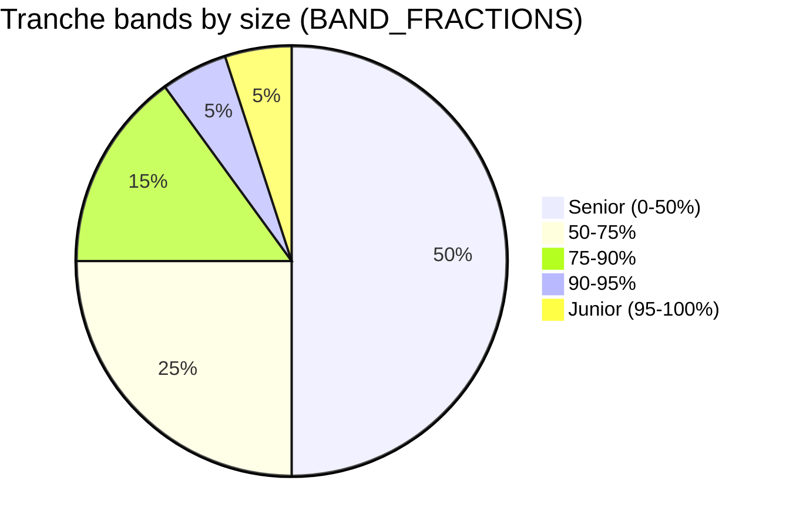
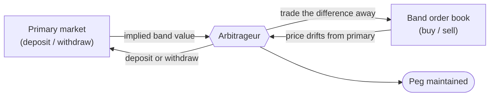

# Mental Model #1

How on-chain tranching works: what a position is, how it's split into
tranches, and how tranches change hands. This describes the trading
mechanism only — where the underlying yield actually comes from (the
mortgage-like asset side) is out of scope here and treated as a black
box, the same way `SimulatedDataProducer` stands in for it in the
current prototype.

## Positions

A user enters by depositing into the pool — the **primary market**.
Their position spans the **entire risk spectrum**, 0–100% exposure,
sized by their deposit — not a slice of it, and there's no pricing
question here: the deposit *is* the position, 1:1 in the underlying
asset. While unsplit, a position earns the pool's blended yield across
that whole range.

A position is, conceptually: `(owner, size, exposure range currently
held)`. On entry, that range is always `[0, 100]`. Selling narrows it —
selling is the **secondary market**, covered below.

## Tranche bands

The 0–100% exposure axis is cut into a **fixed, predefined** set of
bands — mortgage-style: a fat, safe tranche at the bottom, then
progressively thinner, riskier bands toward the top. Bottom bands are
senior: first in line to stay whole, last in line for yield. Top bands
are junior: first to absorb losses, first (and biggest) claim on yield.

These bounds aren't chosen per-trade — a seller can exit along one of
these fixed boundaries (e.g. "sell my senior 50%"), not an arbitrary
custom slice. This mirrors `BAND_FRACTIONS` in `src/tranche.rs` today
(`[0.0, 0.5, 0.75, 0.9, 0.95, 1.0]`): a 50% senior tranche, then 25%,
15%, 5%, 5% bands rising in risk.

The diagram below shows that split by size — a fat safe base tapering
into thin, risky slices at the top.

## Selling a band

Worked example: a user enters on the full `[0, 100]` range, earning
blended yield. They decide to sell their senior tranche — the bottom
50%.

Selling a band transfers it **outright, going forward**: the buyer now
owns that exposure band from that point on — bearing its risk and
receiving its yield. The seller's position shrinks to whatever they
didn't sell — here, the junior `[50, 100]` remainder. Nothing about the
past is undone; this only changes who holds the band from the sale
onward.

## Secondary market: order book

Each fixed tranche band has its **own, separate order book** — a senior
50% order isn't fungible with a junior 5% order, so their markets don't
mix. An order is a **principal and a price**: how much of the band, and
what you're willing to pay for it, priced in the same token as the
primary market (the underlying asset) — not as a yield rate. Buyers and
sellers cross orders directly; there's no epoch, no batching, no waiting
for a close. A crossable order fills immediately.

Because both the primary and secondary markets are **reversible**
(deposit ↔ withdraw, buy ↔ sell) and both are always available
atomically, the two are always tradeable against each other. That
keeps the secondary market **pegged to the primary**: if a band's
order-book price drifted from what the primary market implies for that
slice, an arbitrageur could deposit (or withdraw) on the primary side
and trade the difference away on the secondary side for a profit. The
peg is enforced by arbitrage, not by protocol fiat.

The diagram below traces that arbitrage loop for a single band.

Order books this way are inherently **discrete** — one per fixed band,
about five of them today (`BAND_FRACTIONS`). A future version could
generalize this into a single **continuous market**, two-dimensional
over risk and yield, tracing out a full risk/reward curve instead of
five discrete points on it. That's a later step; for now, discrete
bands with discrete order books is the design.

## Worked example

The same position, at three points in time: full range at entry, after
selling the senior tranche outright, and with part of the remainder
resting as an open order on that band's order book (committed, not yet
filled).

```mermaid
%%{init: {'gantt': {'barHeight': 26, 'barGap': 10, 'topPadding': 40, 'fontSize': 13, 'sectionFontSize': 13}, 'themeVariables': {'doneTaskBkgColor': '#6b7280', 'doneTaskBorderColor': '#4b5563', 'activeTaskBkgColor': '#2563eb', 'activeTaskBorderColor': '#1e3a8a', 'critBkgColor': '#dc2626', 'critBorderColor': '#991b1b', 'taskTextColor': '#ffffff', 'taskTextOutsideColor': '#ffffff', 'taskTextLightColor': '#ffffff', 'taskTextDarkColor': '#ffffff'}} }%%
gantt
    title Target exposure (%), 0-100
    dateFormat X
    axisFormat %s

    section At entry
    held           :done, 0, 100

    section After selling the senior tranche
    sold           :crit, 0, 50
    held           :done, 50, 100

    section Listing part of the remainder
    sold           :crit, 0, 50
    listed         :active, 50, 75
    held           :done, 75, 100
```

- **held** (gray) — still part of your position, earning its share of
  yield.
- **sold** (red) — transferred outright; the buyer now owns this band
  going forward.
- **listed** (blue) — a resting order on that band's order book,
  committed but unfilled.

## Open questions

Deliberately unresolved for now — flagged so they don't get silently
assumed:

- Do resting orders expire, or stay open indefinitely until filled or
  cancelled?
- Who performs the primary/secondary arbitrage that keeps the peg —
  is it permissionless (anyone, MEV-style), or a protocol-level actor?
- What backs market-making on a thin or newly-opened band's order book
  well enough to keep its price reasonable?
- Can a position be sold down across multiple separate fills (partial
  sales layered over time), or is a band's exit an all-or-nothing event
  per position?

## Relationship to the prototype

| Doc term | Code term (`src/tranche.rs`) |
|---|---|
| Exposure axis, 0–100% | `EXPOSURE_MIN`, `EXPOSURE_MAX` |
| Tranche band | `TrancheOrder`, bounded by `attachment`/`detachment` |
| Fixed band boundaries | `BAND_FRACTIONS` |
| Primary snapshot rate | `TrancheOrder::rate` |

`TrancheOrder::rate` is a *yield rate* (the mean `expected_yield` of a
band's cheapest claimed quotes) — it's the prototype's stand-in for what
the primary market implies a band should yield. That's a different
number from a **secondary order-book price** as described above, which
is principal-denominated (priced in the underlying asset, not as a
yield rate) and doesn't exist in the prototype yet.

The prototype today computes tranches as a static, aggregate snapshot
from many independent `Quote`s — there's no `Position` type, no
ownership, no partial transfer, and no order book or time dimension
yet. This document is the mental model those pieces would need to be
built against.
