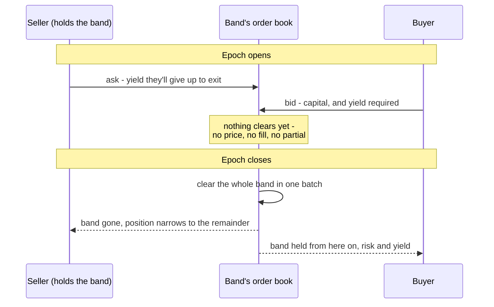
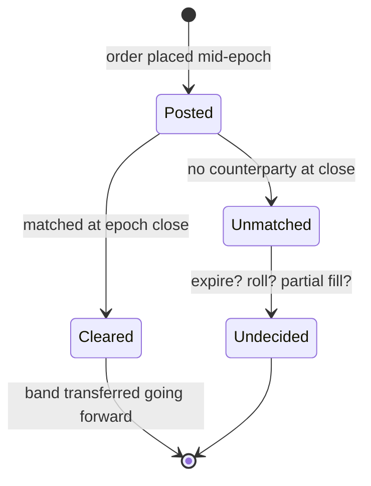

# Mental Model #1

How a position gets split into tranches and how those tranches change
hands. Builds on [Context](./context.md) — the exposure axis, bands,
attachment/detachment and senior/junior are as defined there. In the
prototype the black-boxed asset side is literally a stub:
`SimulatedDataProducer` in `src/data_producer.rs`.

## Positions

A position is, concretely: `(owner, size, exposure range currently
held)`. On entry that range is always the **whole axis**, `[0, 100]`,
sized by the deposit — not a slice of it — so an unsplit position earns
the pool's blended rate across the full range. Selling only ever
narrows the range; it never moves the position sideways.

## Tranche bands

The axis is cut into a **fixed, predefined** set of bands, mortgage-style:
a fat one at the bottom, then progressively thinner ones toward the top.

The bounds aren't chosen per-trade — a seller exits along one of these
preset boundaries (e.g. "sell my senior 50%"), never an arbitrary custom
slice. This mirrors `BAND_FRACTIONS` in `src/tranche.rs` today
(`[0.0, 0.5, 0.75, 0.9, 0.95, 1.0]`): a 50% senior tranche, then 25%,
15%, 5%, 5% bands rising in risk.

## Selling a band

Worked example: a user enters on the full `[0, 100]` range, earning
blended yield. They decide to sell their senior tranche — the bottom
50%.

Selling a band transfers it **outright, going forward**: the buyer now
owns that exposure band from that point on — bearing its risk and
receiving its yield. The seller's position shrinks to whatever they
didn't sell — here, the junior `[50, 100]` remainder. Nothing about the
past is undone; this only changes who holds the band from the sale
onward.

## Epochs and the double auction

Trading happens in **epochs** — e.g. one week each. Within an epoch, for
each fixed tranche band:

- **Sellers** who currently hold that band and want out post asks: how
  much yield they're willing to give up to exit.
- **Buyers** post bids: capital, and the yield they require to take on
  that band.

This is a **two-sided (double) auction** — both sides state terms. It's
conceptually close to `compute_tranches`' existing "sort by rate, fill
by size" sweep, generalized from deriving a rate off one-sided quotes
to matching supply against demand.

Settlement only happens at **epoch close**. An order placed mid-epoch is
a commitment, not a fill — nobody knows their executed price, or
whether they're filled at all, until the epoch ends and that band's
orders are cleared together in a batch. There's no continuous trading
within an epoch.

## Worked example

The same position, at three points in time: full range at entry, after
selling the senior tranche outright, and mid-epoch with part of the
remainder listed in the current auction (committed, not yet settled).

- **held** (gray) — still part of your position, earning its share of
  yield.
- **sold** (red) — transferred outright; the buyer now owns this band
  going forward.
- **in auction** (blue) — asks/bids posted this epoch, outcome unknown
  until close.

## Open questions

Deliberately unresolved for now — flagged so they don't get silently
assumed:

- What happens to orders left unmatched at epoch close: do they expire,
  roll into the next epoch, or partial-fill?
- How is a single clearing rate computed for a band when its total
  buy-side and sell-side size don't match?
- Can a position be sold down across multiple epochs (partial sales
  layered over time), or is a band's exit an all-or-nothing event per
  position?

## Relationship to the prototype

The one term this page adds on top of Context's vocabulary already
exists in the code: the fixed band boundaries are `BAND_FRACTIONS` in
`src/tranche.rs`.

The prototype today computes tranches as a static, aggregate snapshot
from many independent `Quote`s — there's no `Position` type, no
ownership, no partial transfer, and no epoch/time dimension yet. This
document is the mental model those pieces would need to be built
against.
