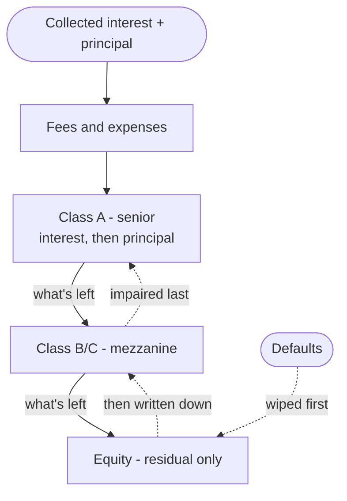
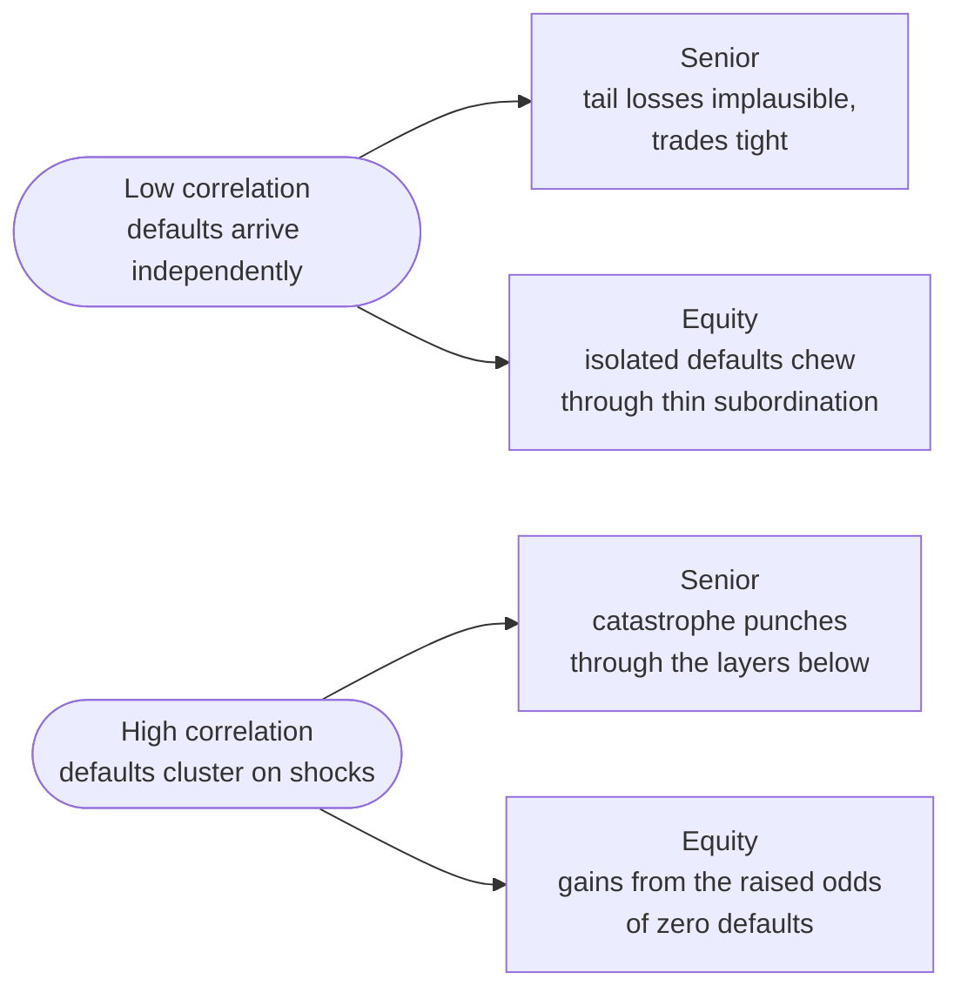
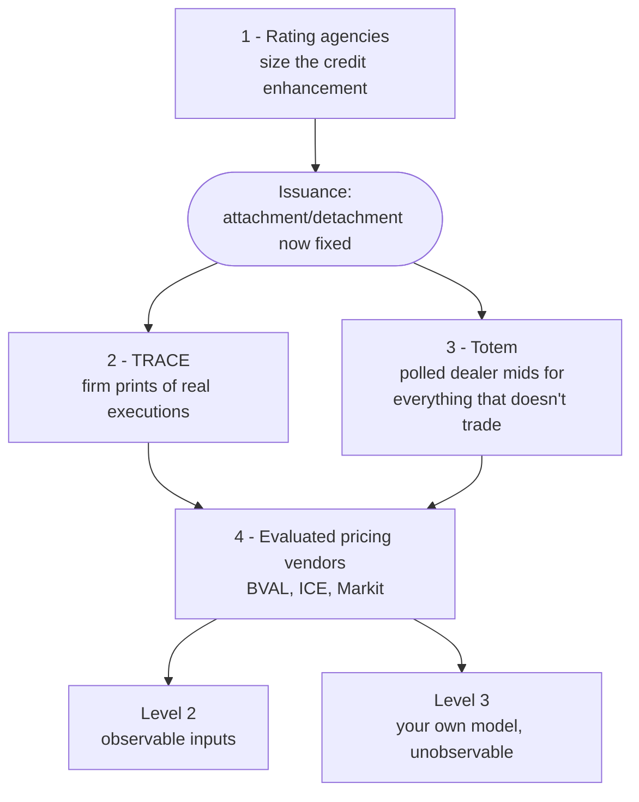

# The TradFi Implementation

Tranching is not a new idea. Structured credit has run it at scale for
decades, and the vocabulary this project borrows — attachment,
detachment, senior, junior — comes from there intact.

This page summarises how traditional finance actually implements
tranching: the legal and cash-flow machinery, the models used to price
the layers, and the institutional apparatus that produces a price at
all. The last section maps it back onto [this
prototype](./context.md) — including the parts we don't have.

## Structure

### The SPV

An originator sells a pool of income-producing assets — residential
mortgages, commercial real estate loans, leveraged corporate loans, auto
receivables, credit card balances — to a **Special Purpose Vehicle**, a
bankruptcy-remote entity whose only job is to hold that pool and issue
claims against it.

Bankruptcy remoteness is the point: if the originator fails, its general
creditors cannot reach the pool. The security's value then depends on
exactly two things — the cash the collateral generates, and the
structural rules in the indenture. Nothing else.

### The waterfall

The SPV funds the purchase by issuing a stack of liabilities. Collected
interest and principal flow down that stack in a contractually fixed
priority order — the **cash flow waterfall**:

Losses run the other way, bottom-up. Solid arrows below are cash going
down the stack; dotted arrows are losses climbing back up it.

| Layer | Rating | Position | Compensation |
|---|---|---|---|
| **Senior** (Class A) | AAA/Aaa | First claim on all cash, last to take loss | Narrow spread; bank treasuries, insurers, pensions |
| **Mezzanine** (Class B/C) | AA–BB | Paid only after senior is whole | Wider coupon for subordinate standing |
| **Equity** (first-loss) | Unrated | Residual only — no contractual coupon | Excess spread, after every other claim |

The equity tranche is the buffer. It absorbs the first defaults so the
rated debt above it doesn't, and it's paid in whatever is left over
rather than a promised rate.

### Attachment and detachment

A tranche is defined by two numbers, both as percentages of the initial
collateral balance: its **attachment point** $\alpha_1$ and its
**detachment point** $\alpha_2$. The gap between them, $\alpha_2 -
\alpha_1$, is the tranche's *thickness*.

Given a cumulative pool loss $L$, the fraction of the tranche wiped out
is:

$$
L_T = \frac{\min(\max(L - \alpha_1,\, 0),\; \alpha_2 - \alpha_1)}{\alpha_2 - \alpha_1}
$$

A clamped ramp. An equity piece at $[0\%, 3\%]$ eats every loss up to 3%
of par and is gone at 3%; the junior mezzanine at $[3\%, 7\%]$ starts
taking losses only then. A senior tranche attaching at 15% is untouched
until 15% of the pool has been liquidated at zero recovery.

The same stack at three levels of cumulative loss — gray is whole, blue
is partially written down, red is gone:

```mermaid
gantt
    title Cumulative pool loss (% of par), stack drawn 0-30
    dateFormat X
    axisFormat %s

    section L = 2%
    equity, 2/3 gone     :active, 0, 3
    junior mezz, whole   :done, 3, 7
    senior, whole        :done, 7, 30

    section L = 5%
    equity, wiped        :crit, 0, 3
    junior mezz, hit     :active, 3, 7
    senior, whole        :done, 7, 30

    section L = 20%
    equity, wiped        :crit, 0, 3
    junior mezz, wiped   :crit, 3, 7
    senior, impaired     :active, 7, 30
```

**This is the same construct as our exposure axis, with the direction
flipped.** In this repo, exposure 100 is first-loss and exposure 0 is
safest; in structured credit, losses climb from attachment 0 upward.
Same band, same `[attachment, detachment)` interval arithmetic, opposite
orientation.

```mermaid
gantt
    title The same stack, drawn on both conventions
    dateFormat X
    axisFormat %s

    section Structured credit, by attachment %
    first loss   :crit, 0, 10
    mezzanine    :active, 10, 30
    senior       :done, 30, 100

    section This repo, by exposure
    senior       :done, 0, 70
    mezzanine    :active, 70, 90
    first loss   :crit, 90, 100
```

### Credit enhancement

Debt tranches reach their ratings through stacked protections:

- **Subordination** — the face value of everything ranking junior, i.e.
  the losses that must occur before this tranche is touched.
- **Overcollateralization** — issuing \$90M of debt against \$100M of
  collateral leaves a \$10M cushion from day one.
- **Excess spread** — the margin between the weighted-average coupon
  collected and the weighted-average coupon paid out, trapped
  periodically to cover current write-offs.
- **Reserve accounts** — cash funded at closing or built from trapped
  spread, covering temporary interest shortfalls.
- **Performance triggers** — covenants on default rates, delinquencies,
  or OC/IC ratios. A breach *rewrites the waterfall*: mezzanine and
  equity distributions stop, and all cash is redirected to paying down
  senior principal until protection is restored.

That last one matters conceptually. The waterfall isn't static — it's
state-dependent, and deteriorating collateral mechanically de-levers the
senior tranche.

### Typical structures

| Structure | Collateral | Senior attachment | Distinguishing feature |
|---|---|---|---|
| **Auto ABS** | Retail auto loans and leases | 10–15% | Static amortizing pool, hard OC, spread trapping |
| **CLO** | Syndicated leveraged loans | 35–40% | Active manager, reinvestment window, OC/IC diversion tests |
| **CMBS** | Commercial real estate | 20–30% | Per-loan LTV/DSC sizing, property diversification adjustment |
| **CFO** | PE / private credit LP interests | 25–40% | NAV coverage tests, capital-call facility, LTV cash sweep |

Note the spread in senior attachment points: how much subordination the
top of the stack needs is a function of collateral behaviour, not a
universal constant.

## Pricing

Tranche value is a **non-linear** function of the pool's loss
distribution, so average expected loss is not enough. What matters is
whether defaults arrive independently or in clusters — the joint
distribution.

### The one-factor Gaussian copula

Introduced by David X. Li in 2000 and still the standard analytical tool
for CDOs and index tranches. For asset $i$ with default time $\tau_i$
and marginal default distribution $F_i(t)$ (bootstrapped from CDS
spreads), map to a latent normal variable:

$$
X_i = \Phi^{-1}(F_i(\tau_i))
$$

Then decompose that latent credit state into one common market factor
and idiosyncratic noise:

$$
X_i = \sqrt{\rho}\, M + \sqrt{1 - \rho}\, Z_i
\qquad M, Z_i \sim \mathcal{N}(0,1)
$$

with $\rho$ the pairwise asset correlation. The trick: **conditional on
a realised $M$, defaults are independent**, and the conditional default
probability has a closed form:

$$
p_i(t \mid M) = \Phi\!\left( \frac{\Phi^{-1}(F_i(t)) - \sqrt{\rho}\, M}{\sqrt{1 - \rho}} \right)
$$

Integrating over the density of $M$ — Gauss-Hermite quadrature or Monte
Carlo — gives the portfolio loss distribution, and from it any tranche's
expected loss:

$$
\mathbb{E}[L_T] = \int_{-\infty}^{\infty} \left[ \sum_{i=1}^N w_i (1 - R_i)\, p_i(t \mid M) \right] \phi(M)\, dM
$$

where $w_i$ is asset weight and $R_i$ expected recovery.

### Correlation moves value across the stack

The single most important intuition in tranche pricing, and it is not
obvious:

- **Low $\rho$** — defaults are near-independent and average out toward
  the pool mean. Extreme tail losses that breach a high attachment point
  are very unlikely, so **senior tranches are cheap to insure and trade
  tight**. But the equity piece bleeds: isolated defaults reliably chew
  through its thin subordination.
- **High $\rho$** — defaults cluster on macro shocks and the loss
  distribution goes bimodal: either almost nothing defaults, or a great
  deal does. Equity losses are capped at $\alpha_2$ anyway, so **equity
  holders gain from the raised probability of a zero-default outcome**.
  Senior holders lose: catastrophic scenarios now punch clean through
  the subordinate layers.

So correlation is not a risk dial that moves all tranches together — it
is a *transfer* of value between the top and the bottom of the stack.
Equity is long correlation; senior is short it.

### Where the model breaks

The Gaussian copula assumes **zero asymptotic tail dependence**: the
probability of simultaneous extreme defaults decays fast in the tail.
Real credit markets do the opposite — correlations spike precisely in
downturns, and joint defaults cluster harder than a normal distribution
allows. This is the flaw that made the model infamous in 2008.

Desks work around it by quoting correlation rather than trusting it:

- **Compound correlation** — the single $\rho$ that reprices one
  observed tranche to its market price.
- **Base correlation** — the $\rho$ that prices an equivalent $[0,
  \alpha_2]$ first-loss piece. Built into a curve across detachment
  points, it's monotonic, removes the pricing anomalies compound
  correlation suffers, and lets desks interpolate prices for bespoke
  attachment/detachment pairs.

### Mortgage collateral: OAS

For RMBS and CMBS, cash flow uncertainty is not only default — borrowers
hold an embedded **call option**, prepaying and refinancing when rates
fall. **Option-Adjusted Spread** is the constant spread over the
risk-free curve that, averaged across $K$ simulated rate paths,
reproduces the observed market price:

$$
P_{\text{market}} = \frac{1}{K} \sum_{k=1}^K \left[ \sum_{t=1}^T \frac{CF_t^{(k)}\big(r_t^{(k)}, CPR_t^{(k)}\big)}{\prod_{s=1}^t \big(1 + r_s^{(k)} + S_{\text{OAS}}\big)} \right]
$$

with $CPR$ the conditional prepayment rate. Stripping out the
refinancing option leaves OAS as a clean read on credit and liquidity
compensation alone.

### Model landscape

| Model | Used for | Captures | Breaks on |
|---|---|---|---|
| One-factor Gaussian copula | Synthetic CDOs, index tranches, CLOs | Default correlation, systemic clustering | Zero tail dependence; understates joint extremes |
| Option-Adjusted Spread | RMBS, CMBS, ABS | Rate volatility, prepayment, option value | Prepayment model calibration |
| Vasicek large-portfolio approximation | Granular consumer ABS, cards, auto | Closed-form asymptotic loss, regulatory VaR | Assumes homogeneous, uniform exposures |
| Student-t / copula mixtures | Bespoke and exotic structured credit | Real tail dependence, jump/regime risk | Computationally heavy, hard to calibrate live |

## Price discovery

There is no exchange. Structured credit trades OTC with no continuous
public order book, so a "price" is manufactured by a layered
institutional pipeline.

**1. Rating agencies size the stack, before issuance.** S&P, Moody's,
Fitch and KBRA are the *ex-ante structural arbiters*: they dictate the
minimum credit enhancement each tranche needs to earn a given rating.
Under S&P's CMBS criteria, each loan gets a stand-alone enhancement
figure

$$
\text{SCE} = 100\% - \left( \frac{\text{stand-alone LTV threshold}}{\text{S\&P LTV}} \right)
$$

then a diversified figure once pooled, $\text{DCE} = \text{SCE} \times
\text{DF}$, with $\text{DF}$ a pool diversity adjustment. Because most
institutional mandates are written in terms of rating buckets, **the
agencies effectively choose the attachment and detachment points** — the
band boundaries are a rating constraint, not a market outcome.

**2. FINRA TRACE reports secondary trades.** US broker-dealers must
report executed price, yield and par volume for securitized products —
agency and non-agency RMBS, CMBS, ABS, 144A CLOs — inside strict
windows. These are firm prints of real executions, and their existence
measurably constrains how much discretion a portfolio manager has over
their own marks.

**3. IHS Markit Totem polls dealers on what doesn't trade.** For
off-the-run mezzanine, residual equity, bespoke CFO tranches — anything
without recent prints — dealers submit anonymous monthly mid-quotes;
Totem screens outliers and returns an aggregated consensus mark. Access
to that feedback cuts a dealer's uncertainty about how peers value
opaque positions by roughly a third. Auditors, clearinghouses and prime
brokers use these marks for independent price verification and margin
calls.

**4. Evaluated pricing vendors synthesise it all daily.** Bloomberg
BVAL, ICE Data Services and Markit combine TRACE prints, Totem
consensus, benchmark curves and cash flow models into security-level
evaluated prices, which feed the ASC 820 / IFRS 13 fair value hierarchy:

- **Level 1** — quoted prices in active markets (rare here).
- **Level 2** — observable inputs: TRACE prints, curves, vendor
  evaluations.
- **Level 3** — unobservable: your own DCF or copula model, used when
  the market gives you nothing.

The through-line: a structured credit price is a **negotiated
institutional artifact**, assembled from rating constraints, sparse
prints, polled quotes and models — not a number discovered by a market
clearing continuously.

## Regulation

Basel III's securitisation framework (CRR3/CRD6 in Europe) governs how
much capital a bank holds against these positions, via a strict
hierarchy: **SEC-IRBA** (approved internal models, keyed off
$K_{\text{IRB}}$, the pool's un-securitized capital charge), then
**SEC-ERBA** (external rating, tranche seniority and thickness fed into
a regulatory matrix), then **SEC-SA** (standardised formula on $K_{SA}$,
adjusted for delinquency).

Two design principles are worth carrying over:

- **Capital non-neutrality.** Total capital required across *all*
  tranches deliberately exceeds the charge for holding the pool
  un-securitized. The excess is a deliberate tax on model uncertainty,
  and it exists to kill regulatory capital arbitrage — tranching must
  not be a way to make risk disappear on paper.
- **Risk retention.** Sponsors must keep a 5% net economic interest,
  either vertically (5% of every tranche) or horizontally (hold the
  first-loss equity). Originators keep skin in the game.

The **STS** regime (Simple, Transparent, Standardised) rewards
structures with standardised eligibility, static pools, transparent
waterfalls and full historical loan data with lower risk weights and
capital floors.

## What this maps to here

| TradFi | This project |
|---|---|
| Attachment / detachment points | `TrancheOrder { attachment, detachment }` — same interval arithmetic |
| Loss allocation ramp $L_T$ | Not implemented; no loss event is ever run |
| Senior / mezzanine / equity | Bands over the exposure axis, junior at 100 |
| Rating agency CE thresholds | `BAND_FRACTIONS` — fixed boundaries, chosen up front |
| Excess spread to equity | The steep top of the cubic yield curve |
| Dealer consensus / evaluated pricing | `compute_tranches` pricing a band off its cheapest quotes |
| TRACE prints, Totem polling, vendors | Replaced by an on-chain double auction ([Mental Model #1](./mental-model-1.md)) |
| SPV, bankruptcy remoteness | The pool contract |
| Risk retention, Basel capital | Absent |

Three honest gaps stand out:

- **No loss model.** The exposure axis describes a waterfall that never
  runs. There is no $L$, no recovery rate, no write-down — so band
  ordering is currently a convention rather than a consequence.
- **No correlation.** The prototype prices each band off its own quotes
  independently. TradFi's central insight is that value moves between
  senior and junior purely as a function of $\rho$; with no dependence
  structure, our pricing cannot express that at all.
- **No dynamic waterfall.** OC/IC triggers make the real waterfall
  state-dependent, redirecting cash to de-lever the senior tranche under
  stress. Nothing here reacts to collateral performance.

And one genuine structural difference, worth being explicit about: in
structured credit the boundaries are set by rating agencies to satisfy
mandate constraints, and secondary prices are assembled after the fact
from polls and models. The design in [Mental Model
#1](./mental-model-1.md) fixes the boundaries the same way — up front,
by convention — but replaces the entire discovery apparatus with a
per-epoch double auction that clears on-chain. The bands are borrowed;
the price discovery is not.
