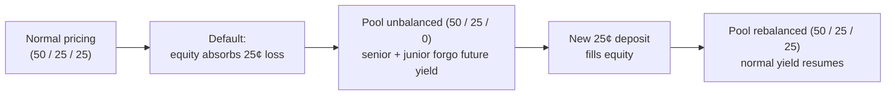

# Tranche Pricing Example

A worked, numeric walkthrough of splitting a position and pricing the pieces.
It uses a simplified three-way split — **senior / junior / equity** — as a
stand-in for the real fixed bands in `BAND_FRACTIONS` (Mental Model #1); the
numbers illustrate the mechanics, not a redesign of the band structure.

## Setup

A position worth **$1.00**, held over the full `[0, 100]` range, backed by
some stablecoin strategy. The current period has an expected yield of **10%**,
so the position's expected value at period close is **$1.10**.

Split it into three tranches:

- **Senior** — the bottom 50%.
- **Junior** — the next 25%.
- **Equity** — the top 25%, first to absorb any loss.

The $1.00 principal splits evenly into the three bands:

  

    
Senior

    
Junior

    
Equity

  

  

    0¢
    50¢
    75¢
    100¢
  

## Floors

Assuming **no default this period** — the only scenario this example covers —
each tranche is worth at least its share of the $1.00 principal: senior 50¢,
junior 25¢, equity 25¢. This isn't a universal guarantee; it's a property of
a loss-free period. Under an actual default, the wipeout mode in
[Invariants](./invariants.md) applies instead, and junior/equity can drop
below their principal.

## Expected values

The market prices risk into how the $1.10 total splits across tranches —
senior gets the smallest slice of yield for the least risk, equity the
largest for the most:

| Tranche | Floor | Expected @ period end | Yield | Yield rate |
|---|---|---|---|---|
| Senior | 50¢ | 51¢ | 1¢ | 2% |
| Junior | 25¢ | 27¢ | 2¢ | 8% |
| Equity | 25¢ | 32¢ | 7¢ | 28% |
| **Total** | **100¢** | **110¢** | **10¢** | **10%** |

## Secondary prices today

What each band costs right now, before the period closes. Because the primary
and secondary markets are reversible and atomically arbitrageable (Mental
Model #1), the three prices must sum to exactly the $1.00 primary price —
otherwise assembling a full-range position via the secondary market would be
cheaper than depositing directly, a riskless arbitrage.

| Tranche | Expected @ period end | Price today | Discount |
|---|---|---|---|
| Senior | 51¢ | 49¢ | 3.9% |
| Junior | 27¢ | 24¢ | 11.1% |
| Equity | 32¢ | 27¢ | 15.6% |
| **Total** | **110¢** | **100¢** | — |

Each bar below is scaled to that tranche's own expected value — full bar
length = expected @ period end, the filled portion = price today, the dark
tick = the floor. The gap between the fill and the bar's end is the
discount; watch it grow from senior to equity:

  

    
Senior

    

      

      

    

    
Floor 50¢ · price today 49¢ · expected 51¢ · discount 3.9%

  

  

    
Junior

    

      

      

    

    
Floor 25¢ · price today 24¢ · expected 27¢ · discount 11.1%

  

  

    
Equity

    

      

      

    

    
Floor 25¢ · price today 27¢ · expected 32¢ · discount 15.6%

  

The discount rate rises with risk — senior lowest, equity highest — and
splits into two components. A shared, near-risk-free **time-value** piece
accounts for capital being locked until period close: the same reason a
guaranteed future payout prices below its face value today, like a T-bill.
That alone is enough to price senior and junior a cent below their own
principal floor — 49¢ and 24¢ against floors of 50¢ and 25¢ — without
anything being wrong; a *guaranteed future* $50 is still worth less than $50
*today*. On top of that shared piece, a **risk premium** grows from senior to
equity. Equity has much more room between its floor (25¢) and its expected
value (32¢), so it can absorb a much larger discount (15.6%) and still price
above its own floor (27¢).

## A default: equity wiped out

Same position, same 50/25/25 split — but this time the underlying strategy
takes a real loss: 25% of the pool's value, exactly equal to equity's
principal. Equity is first in line to absorb losses, so it takes the entire
hit; senior and junior, protected by their seniority, are untouched:

| Tranche | Before default | After default |
|---|---|---|
| Senior | 50¢ | 50¢ |
| Junior | 25¢ | 25¢ |
| Equity | 25¢ | **0¢** |
| **Total** | **100¢** | **75¢** |

Equity is wiped to zero, so it drops out of the post-default pool entirely.
Both bars below are on the same $-per-pixel scale, so senior and junior's
segments stay the same width — only the equity segment, and the pool's
total width, change:

  
Before default — $1.00 pool

  

    
Senior

    
Junior

    
Equity

  

  
After default — 75¢ pool

  

    
Senior

    
Junior

  

Equity lands at exactly $0.00 — never negative, the extreme case of
[Invariants](./invariants.md)' non-negative-value rule, and exactly the
default scenario this doc's floor above was scoped to exclude.

The pool is now unbalanced: 50/25/0 (67% / 33% / 0%) against a 50/25/25
target. That triggers `invariants.md`'s wipeout mode. Senior and junior keep
everything they'd already earned before the default — nothing already
accrued is clawed back. Going forward, though, until the pool rebalances,
they simply stop earning any *further* yield: the 1¢ and 2¢ they'd have
earned this next period (3¢ total, at the rates above) isn't paid to them at
all — it's redirected instead to whoever fills the gap.

A new depositor puts in 25¢. Because the pool is unbalanced, that deposit
isn't spread over the full `[0, 100]` range the way a normal primary deposit
is — it's steered entirely into the empty equity tranche, the only place
that's missing. That depositor now holds the fresh equity position: equity's
own 28% rate, plus the 3¢/period redirected from senior and junior, for as
long as the pool stays unbalanced. Once their deposit lands, the pool is
back to 50¢ / 25¢ / 25¢ — balanced — and normal operation resumes: senior
and junior go back to earning their own yield directly, and the redirect
stops.

## Repricing junior and senior after the wipeout

Neither senior's nor junior's principal is touched by the default, but their
**secondary market price** moves anyway — two effects pull it in opposite
directions. Losing forward yield removes the reason to discount below par,
pulling price *up* toward principal. But each tranche's loss-absorbing
buffer — the capital below it that would take a hit first — also thins,
pulling price *down* because further losses now arrive sooner.

Before the default, senior's buffer was junior plus equity (25¢ + 25¢ =
50¢); junior's buffer was equity alone (25¢). After equity is wiped, senior's
buffer is just junior (25¢) — halved. Junior's buffer is **0¢** — gone
entirely. It's now first in line for any further loss, exactly where equity
used to stand.

The green portion of each bar below is the protecting capital — the buffer
that has to be wiped out before this tranche takes a loss. Gray is the
tranche itself plus anything more senior than it; on the after side, both
bars are 75% as wide as before, the same pool-shrinkage scale used above:

  
Senior's buffer — before

  
Senior's buffer — after

  

    

    
50¢

  

  

    

    
25¢

  

  
Junior's buffer — before

  
Junior's buffer — after

  

    

    
25¢

  

  

    

      

    

    
0¢ — gone entirely

  

### Short term

Before the pool rebalances:

| Tranche | Price before default | Price short-term after | Why |
|---|---|---|---|
| Senior | 49¢ | ~48¢ | The yield-removal pull toward par (50¢) and the thinner buffer's risk discount roughly offset. |
| Junior | 24¢ | ~20¢ | The same pull toward par (25¢) is dominated by a real, new default-risk discount — junior has zero cushion left. |

Junior absorbs almost all of the repricing shock; senior barely moves —
because junior, not senior, lost its *entire* buffer.

### Long term

Once a new depositor rebuilds the equity tranche (previous section), senior
and junior's prices recover back toward their pre-default levels — roughly
49¢ and 24¢. But it's worth being precise about what "recover" means here:
the original 25¢ of equity was **irrecoverably lost** in the default, and
nothing brings it or its holder back. What rebuilds the buffer is entirely
**new capital** — a fresh depositor taking on a brand-new equity position
from zero, unrelated to the wiped-out one. Junior and senior's prices track
that new capital arriving and the buffer being restored, not any reversal of
the original loss. And there's a mild upside beyond just returning to
baseline: the market has now watched the subordination structure absorb a
real loss exactly as designed — equity took the hit, senior and junior were
protected — which is itself a positive signal, not merely a non-event.

The full sequence, from normal pricing through default to recovery:

