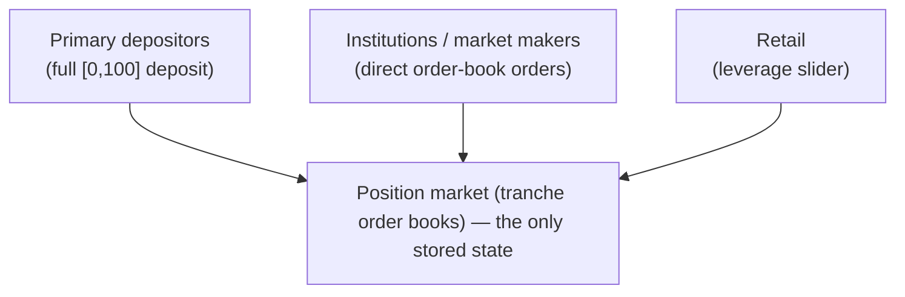

# User Experience

Everything so far (Mental Model #1, Invariants) describes the mechanism —
positions, tranches, the primary and secondary markets. This page is about
what different kinds of users actually see and do on top of it.

All three paths shown below feed the same underlying state — there's only
ever one position market.

## Primary depositors

The basic case is a straight primary deposit, and it feels exactly like
depositing into the underlying asset itself: no tranche picking, no order to
place. The depositor is in for the **entire risk spectrum** — locked into the
whole `[0, 100]` range from the start, same as Mental Model #1 describes.
There's nothing else to decide.

## Institutions and market makers

The other end of the user base — institutions, market makers, firms — deals
directly with the **position market**: the tranche order books described in
Mental Model #1. They place orders on specific bands, on specific positions,
the same way any order-book participant would. This is also who's expected to
do the primary/secondary arbitrage and the market-making that keeps a thin
band's price reasonable (both flagged as open questions in Mental Model #1).

<!--
DRAFT — hidden from the rendered page until reviewed. Not committed.
Delete this comment wrapper (keep the content) once approved, or tell me
what to change.

## The market itself: five books, one asset

"The order book" undersells it — there are five, one per band, and they
don't share liquidity. Same underlying asset, five independently-priced
markets, each with its own price and its own (derived) yield. Numbers
below are illustrative only, not reconciled against a specific worked
example the way tranche-pricing-example.md's are:

  

    
Senior 0-50

    

      
Price <b>98%</b>

      
Yield ~4%

    

  

  

    
50-75

    

      
Price <b>95%</b>

      
Yield ~9%

    

  

  

    
75-90

    

      
Price <b>91%</b>

      
Yield ~15%

    

  

  

    
90-95

    

      
Price <b>85%</b>

      
Yield ~22%

    

  

  

    
Junior 95-100

    

      
Price <b>78%</b>

      
Yield ~30%

    

  

An institution or market maker isn't quoting "the position" — they're
quoting one specific card, and the other four are somebody else's problem
(or opportunity).

## Carving a position into the market

A holder's full `[0, 100]` position doesn't have to be sold whole, or even
along one boundary. They decide which slice to carve out — here, the
senior 50% — and *that* slice becomes an order on that band's book. The
rest keeps earning its own yield, untouched, exactly as in Mental Model
#1's worked example:

  
listed (senior)

  
held

The point this page adds on top of Mental Model #1: that decision is
*where* the order lands. Carve out the senior 50% and it's an order on
the senior book; carve out the top 5% instead and it's an order on the
junior book, at that book's own price and yield — a different market
entirely, not a different corner of the same one.

## Is a tranche's order book one-dimensional or two?

A plain spot order book is effectively one-dimensional: every order is a
(price, size) pair on a single price axis: bids below, asks above,
crossed in the middle. Mental Model #1 currently specifies exactly that
for a tranche's secondary book — "an order is a principal and a price...
not as a yield rate" — so as documented today, it's 1D. Worth stress-
testing that, because fixed-income secondary markets (the closest real
analogue — see traditional-finance.md) very often quote in yield instead
of price, and there's a real reason to want that here too: a price only
means something relative to the market's current *estimate* of expected
value at period close, and that estimate isn't fixed — it moves with new
information and, sharply, around a wipeout (tranche-pricing-example.md's
whole "repricing" section is that estimate moving). A market maker who
actually wants to hold a position at "no worse than 8% yield" has to
recompute and re-post a price order every time that estimate shifts,
where a standing yield order would just re-price itself.

That argues for letting participants quote in either unit — but it
doesn't, on inspection, make the book two-dimensional in the sense that
matters (an engine with two *independently* tradeable axes, needing its
own 2D crossing logic). A yield quote is convertible to a price quote via
one formula (price = expected value / (1 + required yield)), using
whatever the book's current expected-value estimate is at the moment of
conversion. So price and yield aren't two separate liquidity pools to
cross against each other — they're two units for the same one clearing
axis, the same way a stock order can be entered as a limit price or as
"X% below the last trade" without the exchange running two order books.
Concretely: **1D matching engine (price × size), with yield as an
optional second *input unit* that's converted to a price at entry (and
re-converted live, if the order is meant to track the estimate rather
than freeze at post-time) — not a second axis the engine itself crosses
on.**

A genuinely two-dimensional book is a different, bigger question: it
shows up if principal and yield become *separately* tradeable claims on
the same band — an IO/PO-style strip (interest-only / principal-only,
the real MBS technique traditional-finance.md doesn't currently cover).
That would mean two actual order books per band instead of one, each
with its own price × size, and "yield" would stop being a unit
conversion and become a real second market. Nothing in the current
design does that — buying a band today buys the bundled principal-and-
future-yield claim as one unit — so raising it here mainly as a flag:
if strippable yield ever becomes a real feature, *that's* when this
genuinely goes to 2D, not before.

-->

## Retail: the leverage slider

Retail users don't touch the order book directly. Instead they get a single
**slider**, framed as a leverage choice rather than a tranche choice: low
leverage means low risk and low yield (weighted toward the senior end), high
leverage means high risk and high yield (weighted toward the junior end).

The slider is a single control over a two-sided spectrum, translated under
the hood into a basket of band trades. Drag it — it's a real slider, not
just a picture of one:

  <input type="range" min="0" max="100" defaultValue="55" className="doc-slider" aria-label="Leverage, from low (senior-weighted) to high (junior-weighted)" />
  

    

      
Low leverage

      
senior-weighted · low risk / low yield

    

    

      
High leverage

      
junior-weighted · high risk / high yield

    

  

The important design point: the **position market is the only thing the
protocol actually stores.** The slider isn't a separate primitive with its
own state — it's a UX layer that translates a leverage choice into activity
on the same position market everyone else uses. Retail users get a simpler
mental model; underneath, they're still primary depositors and/or position
market participants like everyone else.

## Open questions

- How exactly does the primary/deposit market price a slider position — does
  it decompose into a basket of band trades, a blended primary deposit, or
  something else? Deliberately deferred for now.
- For now, the working assumption is that market making on the position
  market is good enough, and liquid enough, to cover whatever slider
  positions retail generates but discrete bands don't directly handle — and
  to do so profitably for the market makers. That assumption hasn't been
  tested.
