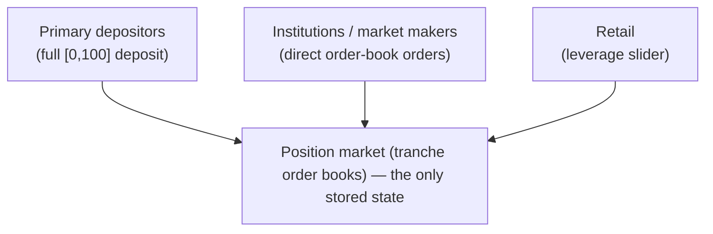

# User Experience

Everything so far (Mental Model #1, Invariants) describes the mechanism —
positions, tranches, the primary and secondary markets. This page is about
what different kinds of users actually see and do on top of it.

All three paths shown below feed the same underlying state — there's only
ever one position market.

## Primary depositors

The basic case is a straight primary deposit, and it feels exactly like
depositing into the underlying asset itself: no tranche picking, no order to
place. The depositor is in for the **entire risk spectrum** — locked into the
whole `[0, 100]` range from the start, same as Mental Model #1 describes.
There's nothing else to decide.

## Institutions and market makers

The other end of the user base — institutions, market makers, firms — deals
directly with the **position market**: the tranche order books described in
Mental Model #1. They place orders on specific bands, on specific positions,
the same way any order-book participant would. This is also who's expected to
do the primary/secondary arbitrage and the market-making that keeps a thin
band's price reasonable (both flagged as open questions in Mental Model #1).

## Retail: the leverage slider

Retail users don't touch the order book directly. Instead they get a single
**slider**, framed as a leverage choice rather than a tranche choice: low
leverage means low risk and low yield (weighted toward the senior end), high
leverage means high risk and high yield (weighted toward the junior end).

The slider is a single control over a two-sided spectrum, translated under
the hood into a basket of band trades. Drag it — it's a real slider, not
just a picture of one:

  <input type="range" min="0" max="100" defaultValue="55" className="doc-slider" aria-label="Leverage, from low (senior-weighted) to high (junior-weighted)" />
  

    

      
Low leverage

      
senior-weighted · low risk / low yield

    

    

      
High leverage

      
junior-weighted · high risk / high yield

    

  

The important design point: the **position market is the only thing the
protocol actually stores.** The slider isn't a separate primitive with its
own state — it's a UX layer that translates a leverage choice into activity
on the same position market everyone else uses. Retail users get a simpler
mental model; underneath, they're still primary depositors and/or position
market participants like everyone else.

## Open questions

- How exactly does the primary/deposit market price a slider position — does
  it decompose into a basket of band trades, a blended primary deposit, or
  something else? Deliberately deferred for now.
- For now, the working assumption is that market making on the position
  market is good enough, and liquid enough, to cover whatever slider
  positions retail generates but discrete bands don't directly handle — and
  to do so profitably for the market makers. That assumption hasn't been
  tested.
